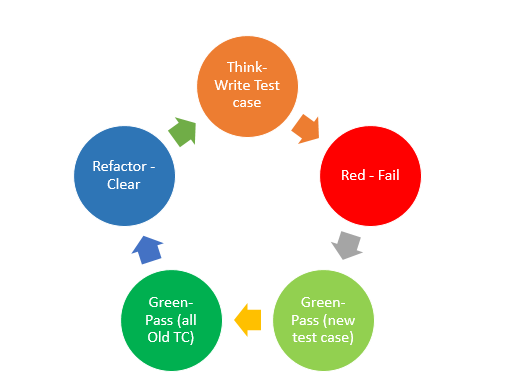

##Test Driven Development (TDD) with Java

####If the number is divided by 3 returns ***"Fizz"***.
####If the number is divided by 5 returns ***"Buzz"***.
####If the number is divided by both 3 and 5 returns ***"Fizz Buzz"***.
####If the number is not divided by both 3 and 5 returns ***the number***.
####If the number is less than 1 returns throws an ***"IllegalArgumentException"*** error.

###Test methods are written with the TDD approach.